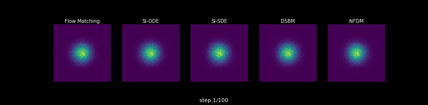
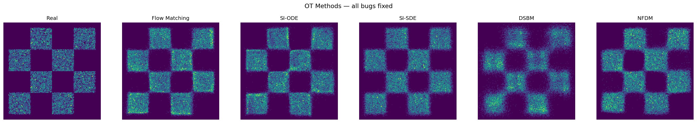
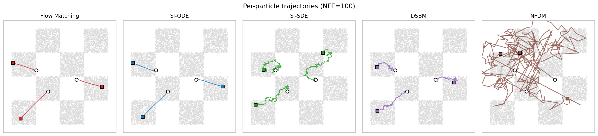
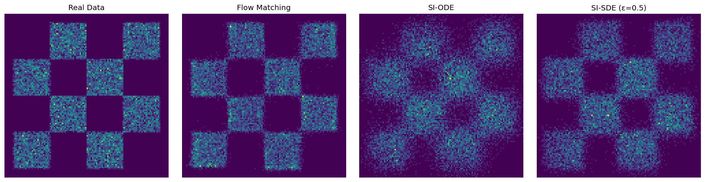
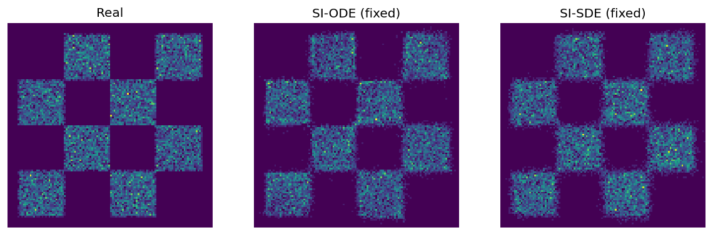
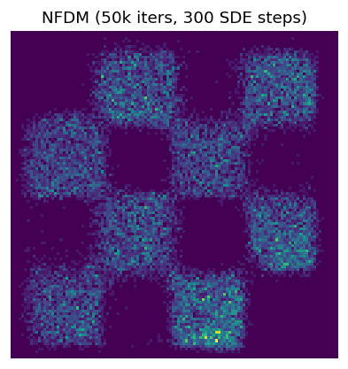

<div align="center">

# OT-models

**Optimal-transport-flavored generative dynamics on one 2D checkerboard benchmark.**



</div>

## Papers

| Method | What it learns | Paper |
|---|---|---|
| Flow Matching | CondOT velocity field | Lipman et al., **Flow Matching for Generative Modeling**, ICLR 2023 ([arXiv](https://arxiv.org/abs/2210.02747)) |
| Stochastic Interpolants | Velocity / score along noisy interpolants | Albergo, Boffi, Vanden-Eijnden, **Stochastic Interpolants**, JMLR 2025 ([JMLR](https://jmlr.org/beta/papers/v26/23-1605.html)) |
| DSBM | Diffusion Schrodinger bridge drifts | Shi, De Bortoli, Campbell, Doucet, **Diffusion Schrodinger Bridge Matching** ([arXiv](https://arxiv.org/abs/2303.16852)) |
| NFDM | Learnable forward diffusion process | Bartosh, Vetrov, Naesseth, **Neural Flow Diffusion Models**, NeurIPS 2024 ([arXiv](https://arxiv.org/abs/2404.12940)) |

## Visuals





| Quick checks | |
|---|---|
|  |  |
|  | |

## Run

```bash
python train.py --method flow_matching
python train.py --method si_ode
python train.py --method si_sde
python train.py --method dsbm
python train.py --method nfdm
```

Checkpoints are written to `checkpoints/` and are intentionally ignored.
